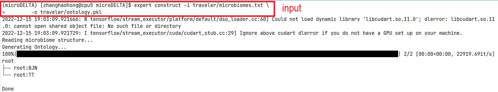
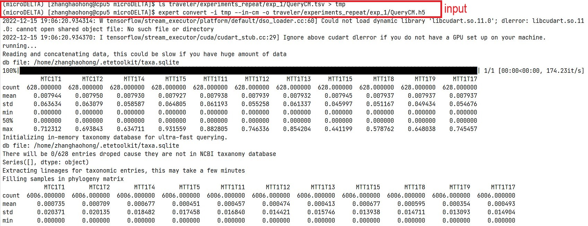
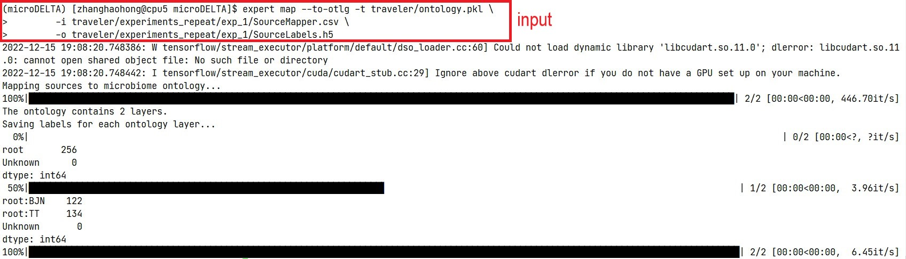
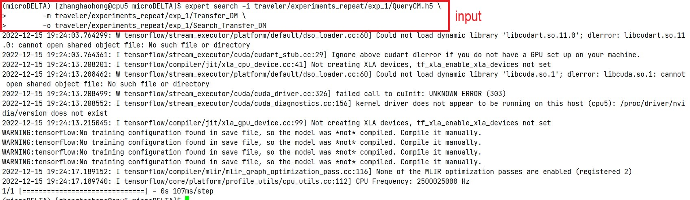

# microDELTA
microDELTA is a deep learning method for tracing longitudinal changes in the human gut microbiome. The method is based on neural networks and transfer learning, and can be used to model dynamic patterns of gut microbial communities at different life stages, including infancy, middle age, and old age. The method takes as input two files containing the abundance of gut microbial communities for a given set of hosts, and uses these data to train a model that can be used to make predictions about the gut microbiome of new hosts. The method also includes an ontology construction step and a data conversion step to make the input data compatible with the model. We have examined microDELTA in several representative contexts: ranging from birth through adulthood to elderly. First, we used microDELTA to illustrate the influence of delivery mode on infant gut microbial communities based on an infant cohort. Second, we examined the spatial-temporal dynamic pattern of gut microbial communities for long-term dietary shifts during international travel based on a Chinese traveler cohort. Third, we explored the seasonal dynamic patterns of gut microbial communities for the Hadza hunter-gatherers. Finally, we analyzed the distinctive gut microbial pattern for elderly people.


## Requirement
The microDELTA method is based on [EXPERT](https://github.com/HUST-NingKang-Lab/EXPERT). Install EXPERT using pip:
```
pip install expert-mst    # Install EXPERT
expert init               # Initialize EXPERT and install NCBI taxonomy database
```
## Command line instructions
To run microDELTA analysis easily, just use `python microDELTA.py` and set the parameters like:
```
python microDELTA.py -O overall_status.txt \
        -l label.csv \
        -S source.tsv \
        -Q query.tsv \
        -m base_model_directory \
        -o output_directory \
```
###  Input files
`-O`: A `txt` file contains the overall status of the hosts. The content in this file include the class of host status like:
```
root:status1
root:status2
```
`-l`: A `csv` file contains the label of each host. The first column named `SampleID` contains the index of each host and the second column named `Env` contains the status of each host like:
|SampleID|Env|
|---|---|
|host1|status1|
|host2|status2|
|host3|status3|
|...|...|

`-S` and `-Q`: Two `tsv` files contain the abundance of gut microbial communities of training sample and testing sample. The columns represent hosts and the rows represents features. We consider `SourceCM.tsv` for training and `QueryCM.tsv` for validating like:

|#OTU ID| host1| host2|...|
|---|---|---|---|
|microbe1|0|0|...|
|microbe2|0|0|...|
|...|...|...|...|


## Example
We take a experiment of the Chinese traveler cohort as an example which consider the sample from "MT1" traveler as query and other samples as source to describe the pipline of microDELTA. The output of each step is shown below the code block.

You can perform this analysis via microDELTA.py and set the parameters as below:
```
python microDELTA.py -O microbiomes.txt \
        -l experiments_repeat/exp_1/SourceMapper.csv \
        -S experiments_repeat/exp_1/SourceCM.tsv \
        -Q experiments_repeat/exp_1/QueryCM.tsv \
        -m ../aging/mst/model/disease_model \
        -o experiments_repeat/exp_1 \
```
You can also perform this analysis by [EXPERT](https://github.com/HUST-NingKang-Lab/EXPERT) step by step.
### Ontology construct
The microDELTA pipeline includes several steps. First, the ontology of the gut microbiome is constructed by creating a hierarchy of host statuses. This step is performed using the `expert construct` command, which takes as input a text file [microbiomes.txt]('traveler/microbiomes.txt') containing the host statuses and produces an ontology file in the form of a pickle object.
```
expert construct -i microbiomes.txt -o ontology.pkl
```

### Data convert
Next, the abundance data are converted into a format that can be used by the model. This is done using the `expert convert` command, which takes as input a directory containing the input files ([SourceCM.tsv](traveler/experiments_repeat/exp_1/SourceCM.tsv ) and [QueryCM.tsv](traveler/experiments_repeat/exp_1/QueryCM.tsv)) and produces a binary data file in the h5 format.

```
ls experiments_repeat/exp_1/SourceCM.tsv > tmp
expert convert -i tmp --in-cm -o experiments_repeat/exp_1/SourceCM.h5

ls experiments_repeat/exp_1/QueryCM.tsv > tmp
expert convert -i tmp --in-cm -o experiments_repeat/exp_1/QueryCM.h5
```

### Source mapping
The status of each sample can be mapped to the ontology using the `expert map` command. This step associates each sample in the input data ([SourceMapper.csv](traveler/experiments_repeat/exp_1/SourceMapper.csv) and [QueryMapper.csv](traveler/experiments_repeat/exp_1/QueryMapper.csv)) with a specific host status, based on the ontology.
```
expert map --to-otlg -t ontology.pkl -i experiments_repeat/exp_1/SourceMapper.csv -o experiments_repeat/exp_1/SourceLabels.h5

expert map --to-otlg -t ontology.pkl -i nn_result/exp_1/QueryMapper.csv -o nn_result/exp_1/QueryLabels.h5
```

### Train the model
With the input data prepared, the model can be trained using the `expert transfer` command. This step uses transfer learning to fine-tune a pre-trained [base model](aging/mst/model/disease_model)  to the specific input data. The resulting model can then be used to make predictions about the gut microbiome of new hosts.
```
expert transfer -i experiments_repeat/exp_1/SourceCM.h5 -t ontology.pkl \
        -l experiments_repeat/exp_1/SourceLabels.h5 -o experiments_repeat/exp_1/Transfer_DM \
        -m ../aging/mst/model/base_model --finetune --update-statistics
```

To performance Neural Network method, use `expert train` to train a independent model by source data.
```
expert train -i nn_result/exp_1/SourceCM.h5 -t ontology.pkl \
        -l nn_result/exp_1/SourceLabels.h5 -o nn_result/exp_1/NN
```

### Test the model
Once the model is trained, it can be used to make predictions about the gut microbiome of new hosts using the expert search command. This step takes as input the trained model and a set of unseen test data, and produces predictions about the gut microbiome of the test data.
```
expert search -i experiments_repeat/exp_1/QueryCM.h5 -m experiments_repeat/exp_1/Transfer_DM -o experiments_repeat/exp_1/Search_Transfer_DM

expert search -i nn_result/exp_1/QueryCM.h5 -m nn_result/exp_1/NN -o nn_result/exp_1/Search
```

